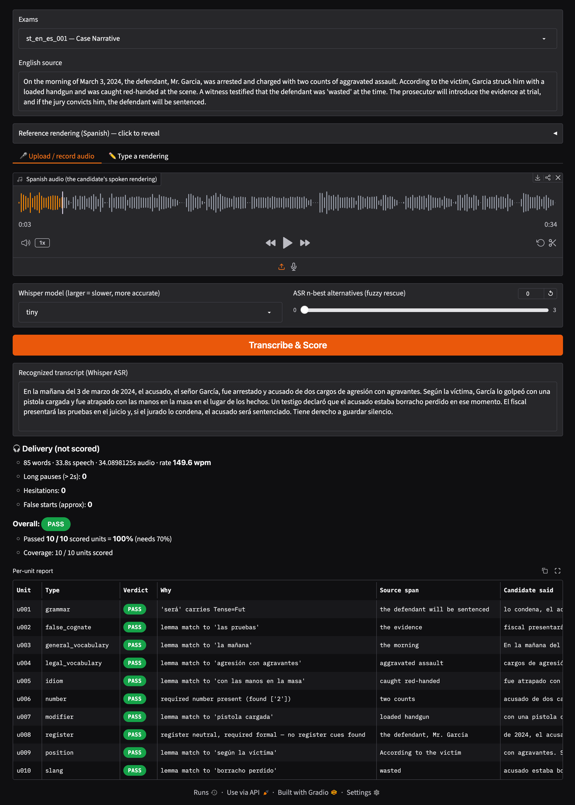

# court-interpret-eval

**An automated evaluation engine for court-interpreter sight translation.**

`evaleng` scores a candidate interpreter's rendering like a certification exam. It evaluates against a fixed inventory of **scoring units**: specific terms, numbers, grammatical features, and register. The engine combines classical, statistical, neural NLP techniques and generates a deterministic span-level feedback with rule-based scoring logic and no LLM. It is the evaluation core of a larger web-based court-interpreter training tool.

---


## Getting started

The environment is managed with conda:

```bash
conda env create -f environment.yml
conda activate evaleng
pip install -e .            # installs the src-layout package in editable mode
python scripts/verify_toolchain.py   # confirms Stanza, RapidFuzz, Whisper, etc. load
```

Score directly from audio:

```bash
python -m evaleng.cli \
    --fixture fixtures/reference_draft.yaml \
    --audio path/to/candidate.mp3 \
    --verbose
```

Score a transcript:

```bash
python -m evaleng.cli \
    --fixture fixtures/reference_draft.yaml \
    --transcript path/to/candidate.txt
```

Score directly from audio, specifying ASR model size, sampling extra ASR hypotheses for n-best alternatives:

```bash
python -m evaleng.cli \
    --fixture fixtures/reference_draft.yaml \
    --audio path/to/candidate.mp3 \
    --asr-model small \
    --nbest 3 \
    --verbose
```

## Interactive demo (web UI)

<p align="center">
  
</p>

#### To use the web UI:
```bash
conda activate evaleng
pip install gradio          # one-time, if not already installed
python app.py
```

This prints a local URL (`http://127.0.0.1:7860`) and a temporary public `*.gradio.live` link that anyone can open while the app is running on local machine. Press `Ctrl+C` to stop. Set `GRADIO_SHARE=false` to run local-only.

## Testing

```bash
pytest                 # full suite
pytest -m "not slow"   # skip Stanza-dependent tests
```

---

## Repo Structure

```
app.py                   Gradio web demo (type or speak a rendering → report)
src/evaleng/
├── schema/models.py     Pydantic scoring-unit + fixture schema
├── ingest/loader.py     YAML → validated fixture
├── interfaces.py        typed contracts passed between stages
├── dispatch.py          unit-type → matcher routing
├── localize.py          reference-projected span localization
├── match/ 
│   ├── number.py        text2num spoken-form normalization → exact compare
│   ├── lexical.py       Stanza lemmatization + RapidFuzz fuzzy matching
│   ├── grammar.py       Universal Dependencies feature checks
│   └── register.py      coarse classifier over Stanza morphology
├── analysis.py          shared Stanza pipeline
├── asr.py               Whisper transcription
├── delivery.py          delivery metrics from word timings
├── pipeline.py          localize → match → n-best → aggregate → feedback
└── cli.py               command-line entry point
fixtures/                exam fixtures (source, reference, units, threshold)
scripts/                 toolchain smoke test
tests/                   pytest suite
```
